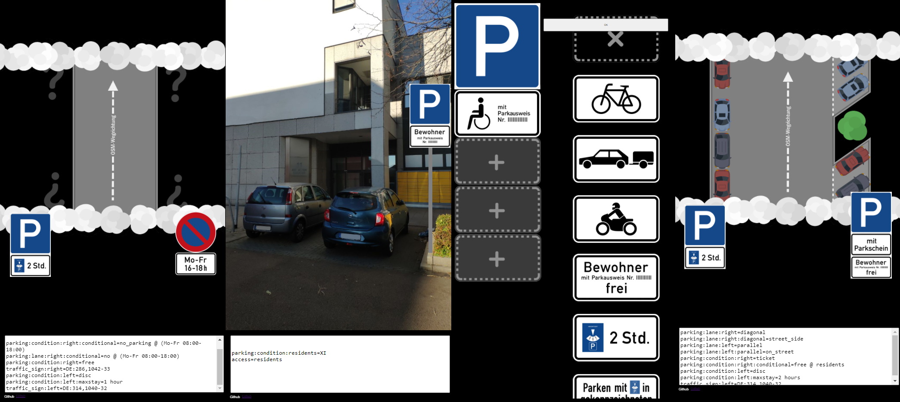

# ParkingStudio
 Eine Webapp, die beim Taggen von Straßenparken in OpenStreetMap hilft.

ParkingStudio hilft, straßenseitges Parken in OpenStreetMap zu erfassen. Man kann die Art und die Orientierung des Parkens, sowie die Beschilderung mit einem einfachen UI zusammenklicken und anschließend die entsprechenden OSM-Tags bequem aus einer Textbox herauskopieren. 

## [Auf GitHub Pages ausprobieren](https://wielandb.github.io/parking-studio/export/html5/)

## Features

- Unterstützt das neue StreetParking-Schema
- Es kann auch _nur_ das physische Parken oder _nur_ die Beschilderung angegeben werden
- Hauptfokus liegt auf dem Taggen des Straßenparkens an Ways, es gibt aber auch einen Modus um Beschilderungen für Parkplatz-Areas/Nodes zu taggen

## Tagging-Definitionen

Die Tags, die die App für die verschiedenen Schilder setzt, kommen aus einem seperaten Repository: [wielandb/osm-parking-tagging](https://github.com/wielandb/osm-parking-tagging). So können das Tagging und die Webapp seperat gepflegt werden. Es bietet außerdem Personen mit besseren Fähigkeiten in UI/UX-Design die möglichkeit, eigne Apps/Websites/Plugins zu schreiben. 

### Wo ist was?

- `assets/` Enthält Assets, die anschließend in Construct 3 importiert worden
- `export/` Enthält Exports des Tools
  - `export/html5` Enthält einen HTML5-Export des Tools
- `project_files`
  - `project_files/project_folder` Enthält das Construct3-Projekt als Projektordner
  - `project_files/single_file` Enthält die c3p-Projektdatei als einzelne Datei
- `showcase/` enthält die Bilder, die in dieser Readme gezeigt werden
